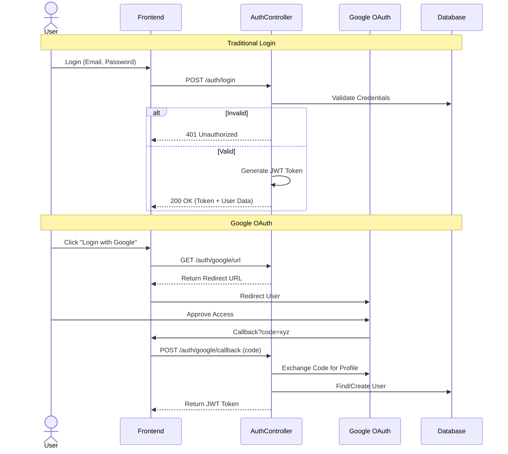
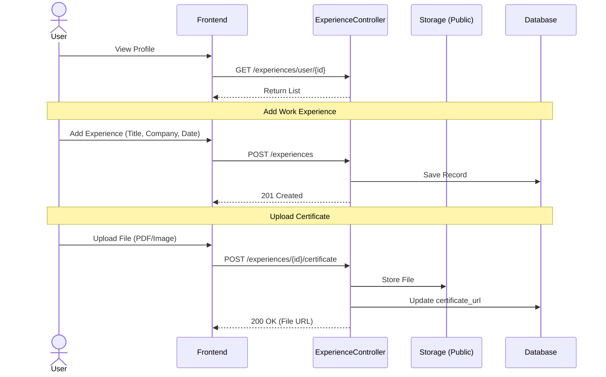
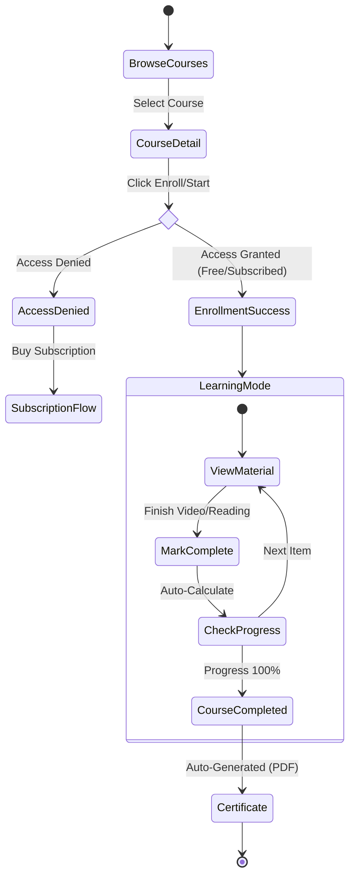
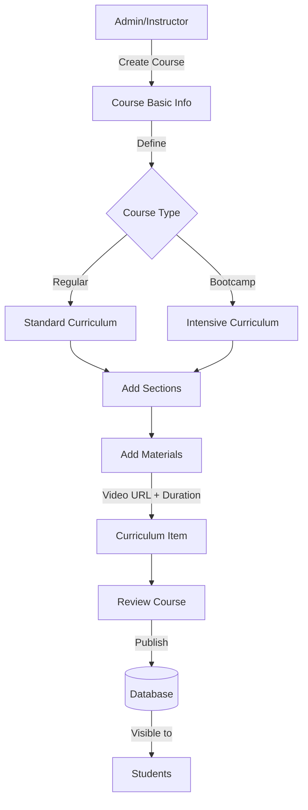
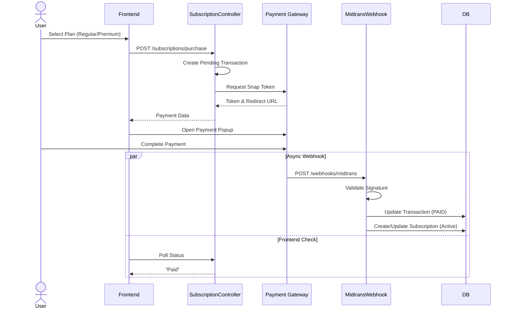
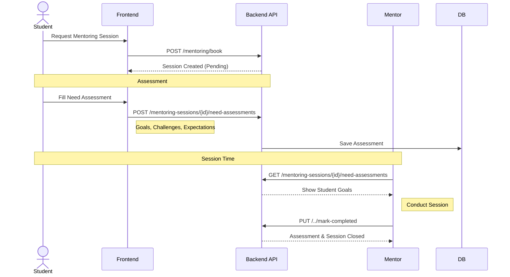
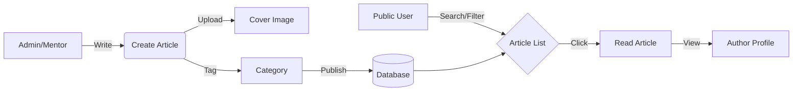
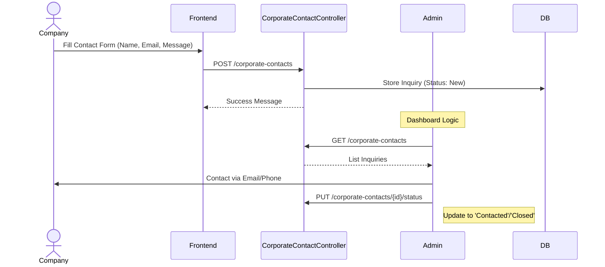

# Application Architecture & User Flows

This document provides a comprehensive technical overview of the application's features, detailing the interaction between users, the frontend, and the backend API services.

## Table of Contents
1. [Authentication & User Profile](#1-authentication--user-profile)
2. [Portfolio & Experience Management](#2-portfolio--experience-management)
3. [Learning Management System (LMS)](#3-learning-management-system-lms)
4. [Course Management (Admin/Instructor)](#4-course-management-admininstructor)
5. [Subscription & Payment System](#5-subscription--payment-system)
6. [Mentoring System](#6-mentoring-system)
7. [Article & Blog System](#7-article--blog-system)
8. [Corporate Services](#8-corporate-services)

---

## 1. Authentication & User Profile

### Registration & Login Logic
Handles user onboarding and session management using JWT.



---

## 2. Portfolio & Experience Management

Allows users to build their professional profile by adding work experience and education.



---

## 3. Learning Management System (LMS)

The core learning flow for students.

### Course Enrollment & Learning Journey


---

## 4. Course Management (Admin/Instructor)

Flow for creating and managing educational content.



---

## 5. Subscription & Payment System

Handles billing, upgrades, and Midtrans integration.

### Purchase Flow


---

## 6. Mentoring System

Connects students with mentors for personalized guidance.

### Booking & Session Flow


---

## 7. Scholarship Portal

Flow for students applying for financial aid.

```mermaid
graph TD
    A[Student] -->|Browse| B[Scholarship List]
    B -->|Select| C[Scholarship Detail]
    C -->|Click Apply| D[Application Form]
    
    D -->|Upload| E[Documents (CV, Transcript)]
    D -->|Submit| F[Backend API]
    F -->|Store| G[(Database)]
    F -->|Notify| H[Admin]
    
    H -->|Review| I{Decision}
    I -->|Accept| J[Update Status: Accepted]
    I -->|Reject| K[Update Status: Rejected]
    
    J & K -->|Notification| L[Student Dashboard]
```

---

## 8. Article & Blog System

Content management system for educational articles.



---

## 8. Corporate Services

Flow for companies to request partnerships or training.


