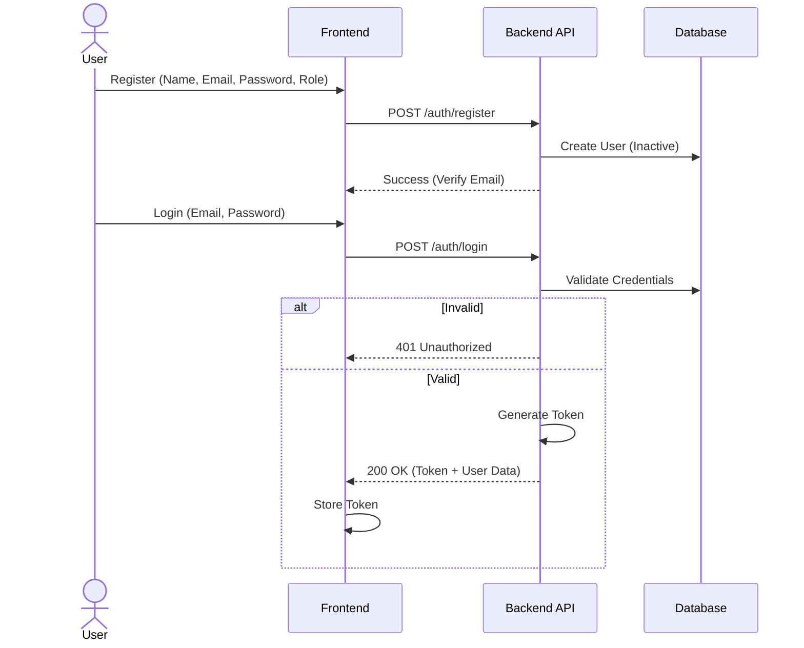
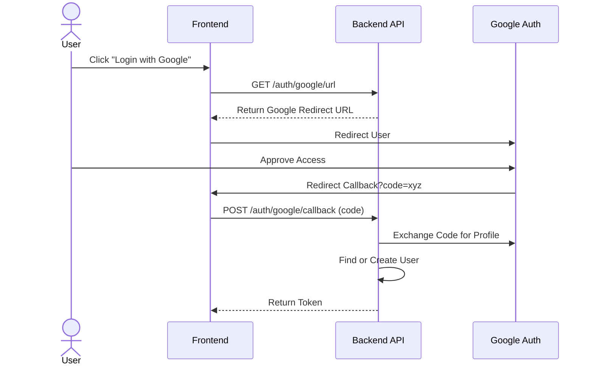
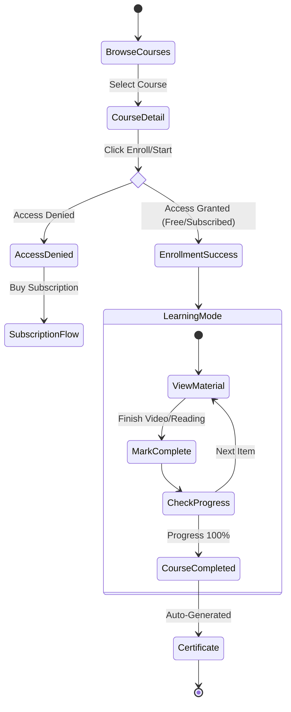
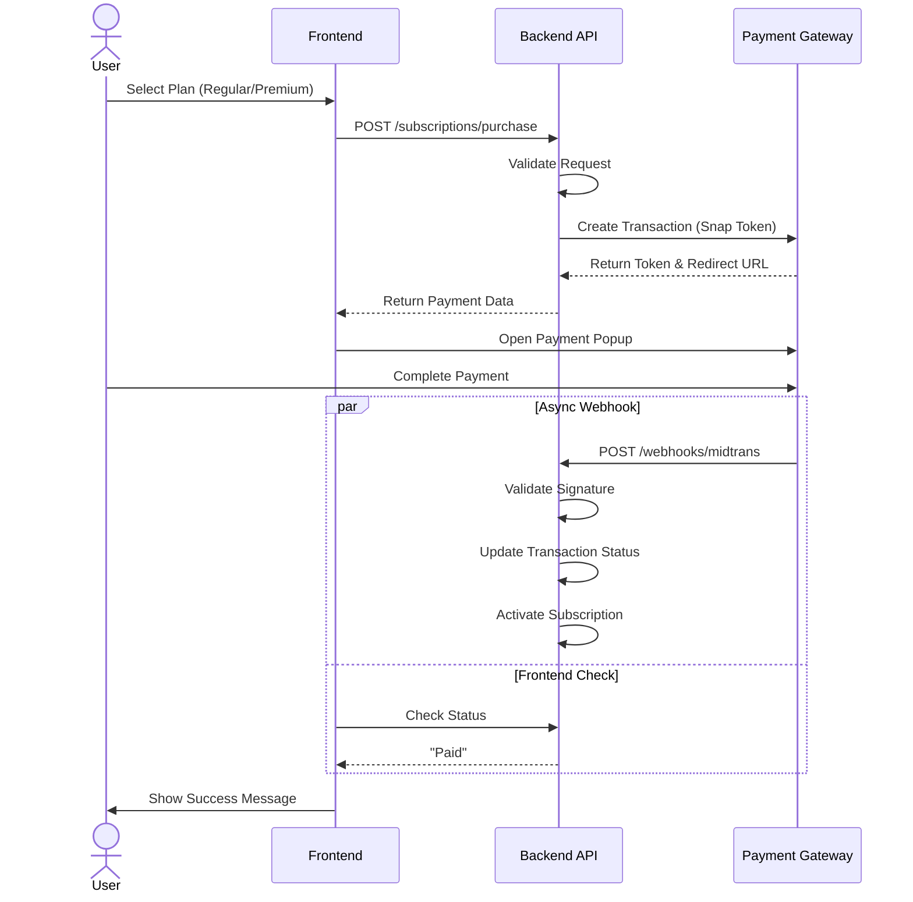
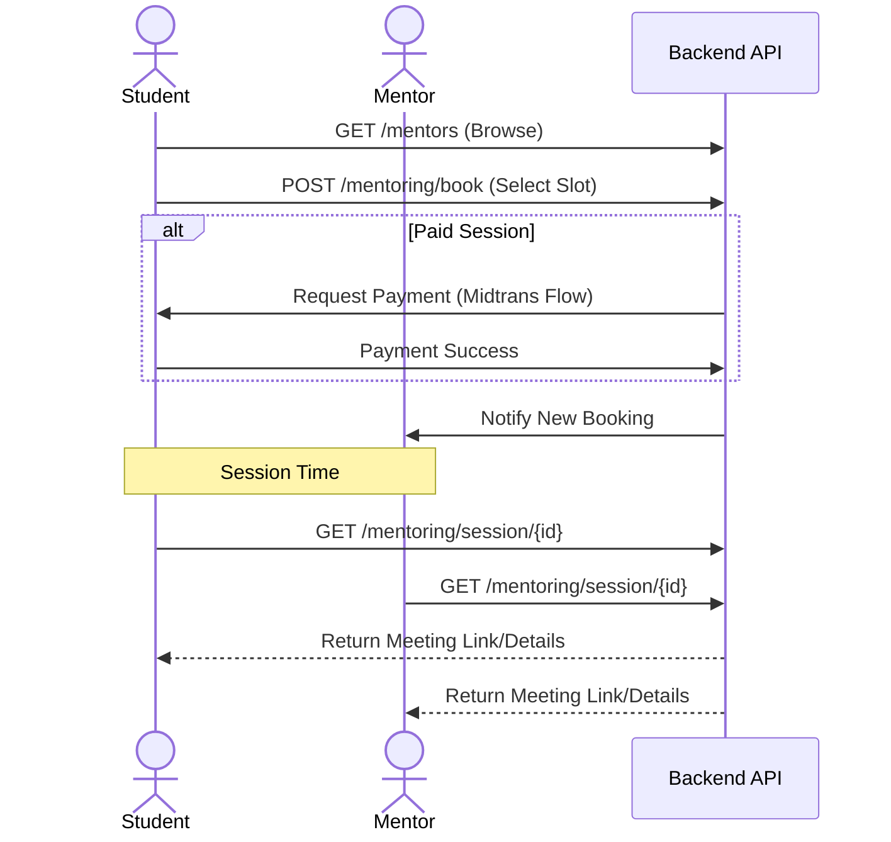
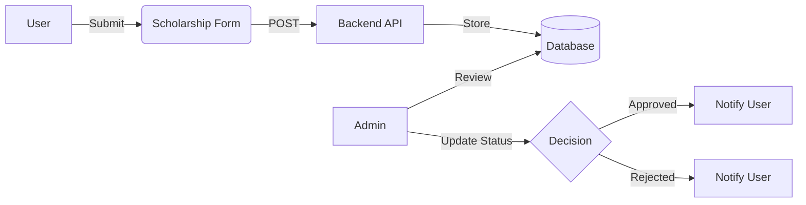
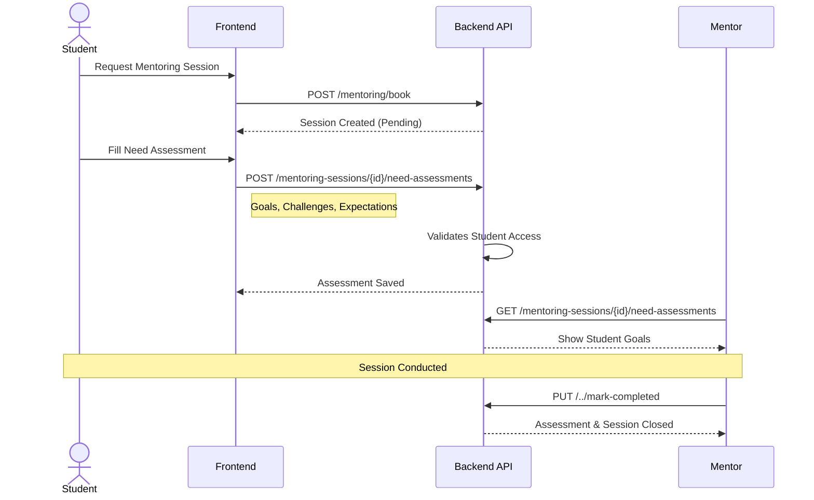

# Application User Flows

This document outlines the primary user flows within the application, visualizing the interaction between users, the frontend, and the backend services.

## 1. Authentication Authorization

### Registration & Login Logic

### Google OAuth Flow

---

## 2. Learning Management System (LMS)

### Course Enrollment & Learning Journey

---

## 3. Subscription & Payment System

### Subscription Purchase Flow

---

## 4. Mentoring System

### Booking & Session Flow

---

## 5. Specialized Features

### Scholarship Application

### Mentoring Need Assessment

