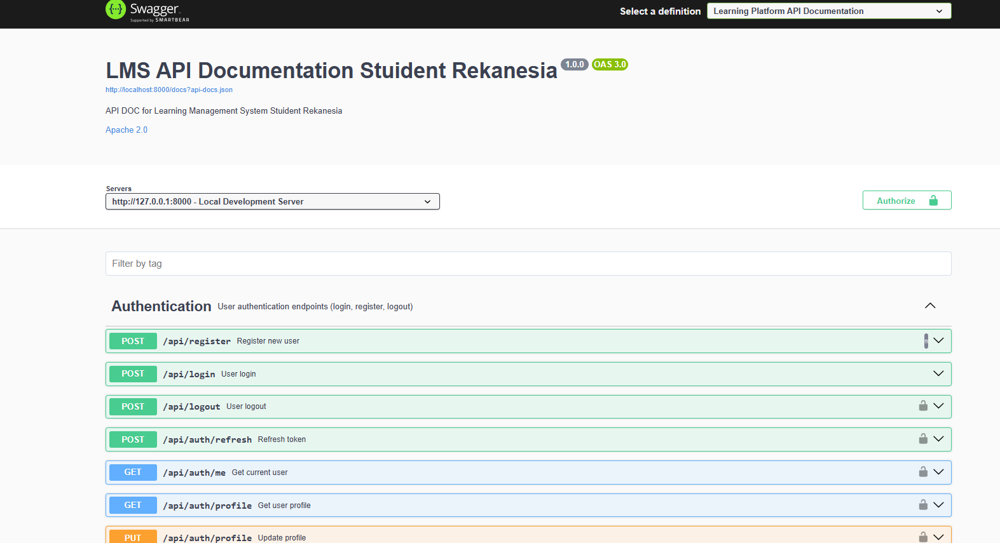
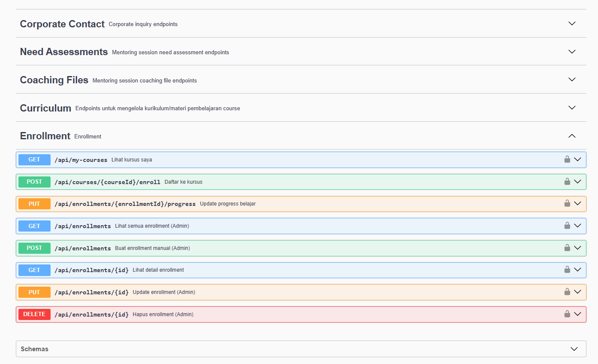

# 🎓 Student App - Backend API

Backend REST API untuk **Student App PT Resultan Karya Indonesia** - Platform edukasi komprehensif untuk mahasiswa dan profesional muda.

---


## 📋 Profil Kelompok

| Informasi | Detail |
|-----------|--------|
| **Nama Tim** | Kelompok 2 |
| **Judul PPIDK** | Stuident App PT Resultan Karya Indonesia |

### 👥 Tim Pengembang

| Nama | Peran |
|------|-------|
| **Moh. Misbahul Musthofah** |  Ketua Tim,  Backend |
| Pandu Nugraha Saputra | Backend, Frontend  |
| Muhamad Rizki Ramadhan Siregar |  Frontend, UI Design |
| Al Hadid Aditya Abidin |  Frontend, UI Design |
| Luqy Muhammad Avif |  Frontend |
| Bima Adnandita | Frontend, UI Design |
| Ahmad Zidan Ali |  Frontend, UI Design |

---


## 🛠️ Tech Stack

| Teknologi | Versi | Deskripsi |
|-----------|-------|-----------|
| **PHP** | ^8.2 | Server-side scripting language |
| **Laravel** | ^12.0 | PHP Framework |
| **JWT Auth** | ^2.2 | Autentikasi berbasis Token |
| **Laravel Socialite** | ^5.23 | OAuth untuk Google Login |
| **Laravel DomPDF** | ^3.1 | Generasi PDF (Sertifikat) |
| **L5 Swagger** | ^9.0 | API Documentation |
| **Bacon QR Code** | ^3.0 | QR Code Generator |

---

## 🚀 Fitur Utama

### 👤 Authentication & User Management
- Register & Login (Email/Password)
- Google OAuth Login
- JWT Token Authentication
- Profile Management (Photo, CV Upload)
- Role-based Access Control (Admin, Corporate, Student, Mentor)

### 📚 Courses & Learning
- Course Management (CRUD - Admin Only)
- Course Curriculum dengan Video
- Enrollment System
- Curriculum Progress Tracking
- Certificate Generation

### 🎓 Scholarships
- Scholarship Listing & Detail
- Multi-step Application Flow:
  - Draft Saving
  - Need Assessment Form
  - Document Upload
  - Review & Submit
- Application Status Management (Admin/Corporate)
- Personalized Recommendations

### 👨‍🏫 Mentoring Sessions
- Mentor Directory
- Session Booking
- Need Assessment
- Coaching Files Upload/Download
- Session Feedback

### 📝 Articles
- Article Management
- Category Filtering
- Popular Articles

### 💳 Subscriptions & Transactions
- Subscription Plans Management
- Payment Proof Upload
- Transaction History
- Admin Payment Verification
- QR Code for Transactions

### 🏢 Corporate Contact
- Corporate Inquiry Submission
- Admin Contact Management

### 📊 Portfolio
- Achievements Management
- Experiences Management
- Organizations Management
- Certificate Upload

---

## 📁 Struktur Project

```
backend/
├── app/
│   ├── Http/
│   │   ├── Controllers/
│   │   │   ├── Api/            # REST API Controllers
│   │   │   │   ├── AuthController.php
│   │   │   │   ├── CourseController.php
│   │   │   │   ├── EnrollmentController.php
│   │   │   │   ├── ScholarshipController.php
│   │   │   │   ├── MentoringSessionController.php
│   │   │   │   ├── ArticleController.php
│   │   │   │   ├── SubscriptionController.php
│   │   │   │   ├── TransactionController.php
│   │   │   │   └── ... (18 controllers)
│   │   │   └── Auth/           # OAuth Controllers
│   │   ├── Middleware/
│   │   └── Requests/           # Form Request Validation
│   └── Models/                 # Eloquent Models (18 models)
├── config/                     # Configuration Files
├── database/
│   ├── migrations/             # Database Migrations (29 migrations)
│   ├── factories/              # Model Factories
│   └── seeders/                # Database Seeders
├── docs/                       # API Documentation
├── routes/
│   └── api.php                 # API Routes Definition
├── storage/                    # File Storage
└── tests/                      # Unit & Feature Tests
```

---

## ⚙️ Instalasi & Setup

### Prerequisites
- PHP >= 8.2
- Composer
- MySQL / PostgreSQL
- Node.js & NPM (untuk development)

### Langkah Instalasi

1. **Clone Repository**
   ```bash
   git clone <repository-url>
   cd backend
   ```

2. **Install Dependencies**
   ```bash
   composer install
   npm install
   ```

3. **Environment Setup**
   ```bash
   cp .env.example .env
   php artisan key:generate
   ```

4. **Configure `.env`**
   ```env
   DB_CONNECTION=mysql
   DB_HOST=127.0.0.1
   DB_PORT=3306
   DB_DATABASE=student_app
   DB_USERNAME=root
   DB_PASSWORD=

   JWT_SECRET=<generate-secret>

   # Google OAuth
   GOOGLE_CLIENT_ID=<your-client-id>
   GOOGLE_CLIENT_SECRET=<your-client-secret>
   GOOGLE_REDIRECT_URI=<callback-url>
   ```

5. **Generate JWT Secret**
   ```bash
   php artisan jwt:secret
   ```

6. **Run Migrations**
   ```bash
   php artisan migrate
   ```

7. **Run Seeders (Optional)**
   ```bash
   php artisan db:seed
   ```

8. **Start Development Server**
   ```bash
   php artisan serve
   ```
   
   Atau menggunakan Composer script:
   ```bash
   composer dev
   ```

---

## 📡 API Endpoints Overview

### Public Endpoints (No Auth Required)

| Method | Endpoint | Description |
|--------|----------|-------------|
| `POST` | `/api/register` | Register new user |
| `POST` | `/api/login` | User login |
| `GET` | `/api/auth/google/redirect` | Google OAuth redirect |
| `GET` | `/api/courses` | List all courses |
| `GET` | `/api/courses/{id}` | Course detail |
| `GET` | `/api/scholarships` | List all scholarships |
| `GET` | `/api/articles` | List all articles |
| `GET` | `/api/mentors` | List all mentors |
| `GET` | `/api/reviews` | List all reviews |

### Protected Endpoints (Auth Required)

#### Auth & Profile
| Method | Endpoint | Description |
|--------|----------|-------------|
| `GET` | `/api/auth/me` | Get current user |
| `GET` | `/api/auth/profile` | Get user profile |
| `PUT` | `/api/auth/profile` | Update profile |
| `POST` | `/api/auth/profile/photo` | Upload profile photo |
| `POST` | `/api/auth/profile/cv` | Upload CV |
| `POST` | `/api/auth/logout` | Logout |

#### Courses & Enrollment
| Method | Endpoint | Description |
|--------|----------|-------------|
| `POST` | `/api/courses/{id}/enroll` | Enroll to course |
| `GET` | `/api/my-courses` | My enrolled courses |
| `PUT` | `/api/enrollments/{id}/progress` | Update progress |
| `POST` | `/api/enrollments/{id}/generate-certificate` | Generate certificate |

#### Scholarships
| Method | Endpoint | Description |
|--------|----------|-------------|
| `POST` | `/api/scholarships/{id}/draft` | Save draft application |
| `PUT` | `/api/scholarship-applications/{id}/assessment` | Submit assessment |
| `POST` | `/api/scholarship-applications/{id}/submit` | Submit application |
| `GET` | `/api/my-applications` | My scholarship applications |

#### Mentoring
| Method | Endpoint | Description |
|--------|----------|-------------|
| `GET` | `/api/mentoring-sessions` | List sessions |
| `POST` | `/api/mentoring-sessions` | Create session |
| `GET` | `/api/my-mentoring-sessions` | My sessions |
| `PUT` | `/api/mentoring-sessions/{id}/status` | Update status |

#### Transactions
| Method | Endpoint | Description |
|--------|----------|-------------|
| `GET` | `/api/transactions` | My transactions |
| `POST` | `/api/transactions/courses/{courseId}` | Course transaction |
| `POST` | `/api/transactions/subscriptions` | Subscription transaction |
| `POST` | `/api/transactions/{id}/payment-proof` | Upload payment proof |

### Admin Only Endpoints

| Method | Endpoint | Description |
|--------|----------|-------------|
| `GET` | `/api/admin/users` | List all users |
| `POST` | `/api/admin/users` | Create user |
| `GET` | `/api/admin/users/statistics` | User statistics |
| `PUT` | `/api/admin/users/{id}/status` | Update user status |
| `POST` | `/api/courses` | Create course |
| `GET` | `/api/transactions/admin/all` | All transactions |
| `POST` | `/api/transactions/{id}/confirm` | Confirm payment |

---

## 🧪 Testing

```bash
# Run all tests
php artisan test

# Run with coverage
php artisan test --coverage
```

---

## 📚 API Documentation

API Documentation tersedia menggunakan Swagger/OpenAPI:

```
http://localhost:8000/api/documentation
```


## 📸 Screenshots


| Dokumentasi Swagger 1 | Dokumentasi Swagger 2 |
|:---:|:---:|
|  |  |

---


---
### Pembimbing:
Akhmad Arip, S.Kom.
#### 🔗 Link Penting

- **Link Data Mentor**: [Google Sheets](https://docs.google.com/spreadsheets/d/1qrL210j2jMh80hD-4aXON-Fab_s2U12neg5g5-hG0qo/edit?usp=sharing)
- **Link FrontEnd**: [FE-Stuident](https://github.com/Panduukece123/Stuident-FE)


### Disajikan Untuk:
- PT Resultan Karya Indonesia


## 📄 License

© 2026 Kelompok 2 – Studi Independen NF Academy
Bekerja sama dengan PT Resultan Karya Indonesia

---


**Made with ❤️ by Kelompok 2 PPIDK**
