# Database Schema Documentation

Dokumentasi ini berisi rancangan lengkap basis data yang digunakan dalam aplikasi Student App.

## Entity Relationship Diagram (ERD)

Berikut adalah visualisasi hubungan antar tabel utama dalam database.

```mermaid
classDiagram
    direction TD
    
    namespace Auth_System {
        class USERS {
            +bigint id PK
            +enum role
            +string email
            +string name
            +json specialization
        }
        class PASSWORD_RESET_TOKENS {
            +string email
            +string token
        }
    }

    namespace Learning_Management {
        class COURSES {
            +bigint id PK
            +string title
            +enum type
            +decimal price
        }
        class COURSE_CURRICULUMS {
            +bigint id PK
            +string title
            +int order
        }
        class ENROLLMENTS {
            +bigint id PK
            +int progress
            +bool completed
        }
        class CURRICULUM_PROGRESS {
            +bool completed
            +timestamp completed_at
        }
    }

    namespace Mentoring_System {
        class MENTORING_SESSIONS {
            +bigint id PK
            +datetime schedule
            +enum status
        }
        class NEED_ASSESSMENTS {
            +json form_data
        }
        class COACHING_FILES {
            +string file_path
        }
    }

    namespace Scholarship_Center {
        class SCHOLARSHIPS {
            +bigint id PK
            +string name
            +date deadline
            +enum status
        }
        class SCHOLARSHIP_APPLICATIONS {
            +bigint id PK
            +enum status
            +string cv_path
        }
    }

    namespace Finance {
        class TRANSACTIONS {
            +bigint id PK
            +decimal amount
            +enum status
            +string type
        }
        class SUBSCRIPTIONS {
            +bigint id PK
            +string plan
            +enum status
            +date end_date
        }
    }

    namespace Portfolio_Profile {
        class EXPERIENCES {
            +string title
            +string company
        }
        class ACHIEVEMENTS {
            +string title
            +year year
        }
        class ORGANIZATIONS {
            +string name
            +string role
        }
    }

    namespace Content_General {
        class ARTICLES {
            +bigint id PK
            +string title
        }
        class REVIEWS {
            +bigint id PK
            +int rating
            +text comment
        }
        class CORPORATE_CONTACTS {
            +bigint id PK
            +string email
            +text message
        }
    }

    %% RELATIONSHIPS
    %% User Core Relations
    USERS "1" --> "*" ENROLLMENTS : enrolls in
    USERS "1" --> "*" TRANSACTIONS : makes
    USERS "1" --> "*" SUBSCRIPTIONS : has
    USERS "1" --> "*" MENTORING_SESSIONS : participates
    USERS "1" --> "*" SCHOLARSHIP_APPLICATIONS : applies
    USERS "1" --> "*" EXPERIENCES : has
    USERS "1" --> "*" ACHIEVEMENTS : has
    USERS "1" --> "*" ORGANIZATIONS : joins
    USERS "1" --> "*" ARTICLES : writes
    USERS "1" --> "*" REVIEWS : writes

    %% Module Internal Relations
    COURSES "1" *-- "*" COURSE_CURRICULUMS : contains
    COURSES "1" --> "*" ENROLLMENTS : has students
    ENROLLMENTS "1" *-- "*" CURRICULUM_PROGRESS : tracks
    COURSE_CURRICULUMS "1" --> "*" CURRICULUM_PROGRESS : completed in

    MENTORING_SESSIONS "1" *-- "*" NEED_ASSESSMENTS : has
    MENTORING_SESSIONS "1" *-- "*" COACHING_FILES : has files

    SCHOLARSHIPS "1" --> "*" SCHOLARSHIP_APPLICATIONS : receives
    
    ORGANIZATIONS "1" --> "*" CORPORATE_CONTACTS : may have
```

## Detail Struktur Tabel

Berikut adalah penjelasan mendetail dari setiap tabel dalam format tabel.

### 1. Authentication & Users

**Tabel: `users`**
Tabel utama untuk menyimpan data pengguna aplikasi.

| Nama Kolom | Tipe Data | Keterangan |
| :--- | :--- | :--- |
| `id` | BigInt (PK) | Primary Key |
| `role` | Enum | `student`, `mentor`, `admin`, `corporate` |
| `name` | String | Nama lengkap pengguna |
| `email` | String (Unique) | Alamat email (login) |
| `password` | String | Password terenkripsi |
| `specialization` | JSON | Bidang keahlian/minat pengguna |
| `google_id` | String | ID untuk login Google (Nullable) |
| `profile_photo` | String | URL foto profil |
| `cv_path` | String | URL file CV pengguna |

**Tabel: `password_reset_tokens`**
Menyimpan token untuk reset password.

| Nama Kolom | Tipe Data | Keterangan |
| :--- | :--- | :--- |
| `email` | String (PK) | Email pengguna |
| `token` | String | Token verifikasi |
| `created_at` | Timestamp | Waktu pembuatan link |

### 2. E-Learning (Course & Curriculum)

**Tabel: `courses`**
Menyimpan data kelas atau bootcamp.

| Nama Kolom | Tipe Data | Keterangan |
| :--- | :--- | :--- |
| `id` | BigInt (PK) | Primary Key |
| `title` | String | Judul course |
| `type` | Enum | `course`, `bootcamp` |
| `access_type` | Enum | `free`, `regular`, `premium` |
| `price` | Decimal | Harga course |
| `video_url` | Text | Link video preview/intro |
| `description` | Text | Deskripsi lengkap course |

**Tabel: `course_curriculums`**
Menyimpan silabus/materi course.

| Nama Kolom | Tipe Data | Keterangan |
| :--- | :--- | :--- |
| `id` | BigInt (PK) | Primary Key |
| `course_id` | BigInt (FK) | Relasi ke tabel `courses` |
| `section` | String | Nama Bab/Section |
| `title` | String | Judul Materi |
| `duration` | String | Estimasi durasi (mis: "10 menit") |
| `order` | Integer | Urutan materi |

**Tabel: `enrollments`**
Mencatat partisipasi user dalam course.

| Nama Kolom | Tipe Data | Keterangan |
| :--- | :--- | :--- |
| `id` | BigInt (PK) | Primary Key |
| `user_id` | BigInt (FK) | Student yang mendaftar |
| `course_id` | BigInt (FK) | Course yang diambil |
| `progress` | Integer | Persentase (0-100) |
| `completed` | Boolean | Status kelulusan |
| `certificate_url` | String | Link file sertifikat |

**Tabel: `curriculum_progress`**
Tracking detail per materi.

| Nama Kolom | Tipe Data | Keterangan |
| :--- | :--- | :--- |
| `id` | BigInt (PK) | Primary Key |
| `enrollment_id` | BigInt (FK) | Relasi ke enrollment |
| `curriculum_id` | BigInt (FK) | Relasi ke materi spesifik |
| `completed` | Boolean | Status selesai |

### 3. Mentoring

**Tabel: `mentoring_sessions`**
Jadwal sesi mentoring.

| Nama Kolom | Tipe Data | Keterangan |
| :--- | :--- | :--- |
| `id` | BigInt (PK) | Primary Key |
| `mentor_id` | BigInt (FK) | User (Mentor) |
| `member_id` | BigInt (FK) | User (Student/Mentee) |
| `schedule` | DateTime | Waktu pelaksanaan |
| `meeting_link` | String | Link Zoom/GMeet |
| `status` | Enum | `pending`, `scheduled`, `completed`, `cancelled` |

**Tabel: `need_assessments`**
Assessment kebutuhan mentee.

| Nama Kolom | Tipe Data | Keterangan |
| :--- | :--- | :--- |
| `id` | BigInt (PK) | Primary Key |
| `mentoring_session_id` | BigInt (FK) | Sesi terkait |
| `form_data` | JSON | Isian form assessment |

**Tabel: `coaching_files`**
File pendukung sesi mentoring.

| Nama Kolom | Tipe Data | Keterangan |
| :--- | :--- | :--- |
| `id` | BigInt (PK) | Primary Key |
| `mentoring_session_id` | BigInt (FK) | Sesi terkait |
| `file_path` | String | Lokasi file |
| `file_type` | String | Jenis file |

### 4. Scholarships (Beasiswa)

**Tabel: `scholarships`**
Program beasiswa.

| Nama Kolom | Tipe Data | Keterangan |
| :--- | :--- | :--- |
| `id` | BigInt (PK) | Primary Key |
| `name` | String | Nama beasiswa |
| `description` | Text | Deskripsi lengkap |
| `status` | Enum | `open`, `closed`, `coming_soon` |
| `deadline` | Date | Batas akhir pendaftaran |

**Tabel: `scholarship_applications`**
Pendaftaran beasiswa.

| Nama Kolom | Tipe Data | Keterangan |
| :--- | :--- | :--- |
| `id` | BigInt (PK) | Primary Key |
| `scholarship_id` | BigInt (FK) | Program beasiswa |
| `user_id` | BigInt (FK) | Pelamar |
| `status` | Enum | `submitted`, `review`, `accepted`, `rejected` |
| `cv_path` | String | File CV pelamar |
| `motivation_letter` | String | Surat motivasi |

### 5. Transactions & Payment

**Tabel: `transactions`**
Pusat data transaksi.

| Nama Kolom | Tipe Data | Keterangan |
| :--- | :--- | :--- |
| `id` | BigInt (PK) | Primary Key |
| `transaction_code` | String (Unique) | Kode unik transaksi |
| `user_id` | BigInt (FK) | Pembayar |
| `amount` | Decimal | Nominal bayar |
| `payment_method` | Enum | `qris`, `bank_transfer`, `manual`, dll |
| `status` | Enum | `pending`, `paid`, `failed`, `expired` |
| `transactionable_type` | String | Model terkait (Course/Subscription) |
| `transactionable_id` | BigInt | ID dari model terkait |

**Tabel: `subscriptions`**
Langganan user.

| Nama Kolom | Tipe Data | Keterangan |
| :--- | :--- | :--- |
| `id` | BigInt (PK) | Primary Key |
| `user_id` | BigInt (FK) | User |
| `plan` | String | Nama paket (`free`/`premium`) |
| `start_date` | Date | Mulai aktif |
| `end_date` | Date | Berakhir |
| `status` | Enum | `active`, `expired` |

### 6. Portfolio & Profile

**Tabel: `experiences`** (Pengalaman Kerja), **`achievements`** (Prestasi), **`organizations`** (Organisasi).

| Nama Tabel | Kolom Penting | Keterangan |
| :--- | :--- | :--- |
| `experiences` | `title`, `company`, `type` | Riwayat pekerjaan/magang |
| `achievements` | `title`, `year`, `organization` | Penghargaan yang diraih |
| `organizations` | `name`, `role`, `description` | Riwayat organisasi |

### 7. Content & Feedback

**Tabel: `articles`** (Artikel), **`reviews`** (Ulasan), **`corporate_contacts`** (Pesan).

| Nama Tabel | Kolom Penting | Keterangan |
| :--- | :--- | :--- |
| `articles` | `title`, `content`, `category` | Konten artikel edukasi |
| `reviews` | `rating`, `comment`, `reviewable` | Rating bintang 1-5 |
| `corporate_contacts` | `name`, `email`, `message` | Inquiry dari perusahaan |
