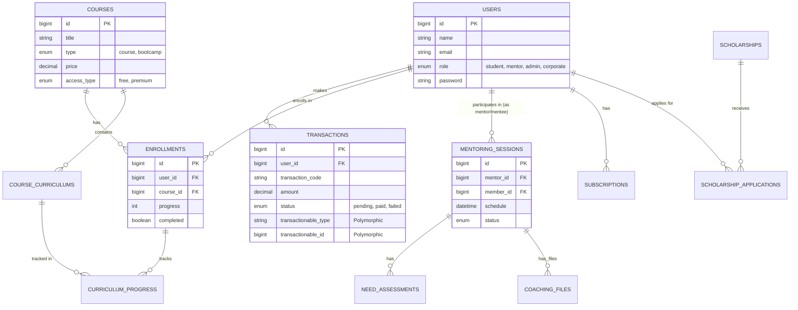

# Database Schema Documentation

Dokumentasi ini berisi rancangan basis data yang digunakan dalam aplikasi Student App.

## Entity Relationship Diagram (ERD)

Berikut adalah visualisasi hubungan antar tabel utama dalam database.

## Deskripsi Tabel Utama

### 1. Users
Menyimpan data semua pengguna aplikasi.
- **role**: Membedakan hak akses (student, mentor, admin, corporate).
- **specialization**: Menyimpan data spesialisasi user (misal: IT, Business).

### 2. Courses & Curriculum
Menyimpan data kursus dan materi pembelajarannya.
- **courses**: Data ssecara umum (judul, harga, instruktur).
- **course_curriculums**: Daftar materi (bab/sub-bab) dalam satu course.
- **curriculum_progress**: Menyimpan status penyelesaian setiap materi oleh user (logika: jika enrollment_id X sudah menyelesaikan curriculum_id Y).

### 3. Transactions
Tabel sentral untuk segala jenis pembayaran.
- **Polymorphic Relation**: Menggunakan `transactionable_type` dan `transactionable_id` sehingga satu tabel bisa menangani pembelian Course, Subscription, maupun Mentoring.

### 4. Mentoring
- **mentoring_sessions**: Jadwal sesi antara mentor dan student.
- **need_assessments**: Catatan kebutuhan student sebelum sesi dimulai.
- **coaching_files**: File materi yang diupload mentor untuk sesi tersebut.

### 5. Scholarships
- **scholarships**: Program beasiswa yang dibuka oleh Corporate.
- **scholarship_applications**: Data pendaftaran student untuk beasiswa tertentu.
