# Database Schema Documentation

Dokumentasi ini berisi rancangan lengkap basis data yang digunakan dalam aplikasi Student App.

## Entity Relationship Diagram (ERD)

Berikut adalah visualisasi hubungan antar tabel utama dalam database.

```mermaid
classDiagram
    direction TD
    
    %% RELATIONS
    USERS "1" --> "*" TRANSACTIONS : makes
    USERS "1" --> "*" ENROLLMENTS : enrolls in
    USERS "1" --> "*" MENTORING_SESSIONS : participates
    USERS "1" --> "*" SUBSCRIPTIONS : has
    USERS "1" --> "*" SCHOLARSHIP_APPLICATIONS : applies
    USERS "1" --> "*" EXPERIENCES : has
    USERS "1" --> "*" ACHIEVEMENTS : has
    USERS "1" --> "*" ORGANIZATIONS : joins
    USERS "1" --> "*" ARTICLES : writes
    USERS "1" --> "*" REVIEWS : writes

    COURSES "1" --> "*" COURSE_CURRICULUMS : contains
    COURSES "1" --> "*" ENROLLMENTS : has students

    ENROLLMENTS "1" --> "*" CURRICULUM_PROGRESS : tracks
    COURSE_CURRICULUMS "1" --> "*" CURRICULUM_PROGRESS : completed in

    MENTORING_SESSIONS "1" --> "*" NEED_ASSESSMENTS : has
    MENTORING_SESSIONS "1" --> "*" COACHING_FILES : has files

    SCHOLARSHIPS "1" --> "*" SCHOLARSHIP_APPLICATIONS : receives

    %% TABLES
    class USERS {
        +bigint id (PK)
        +string name
        +string email
        +enum role
        +json specialization
    }
    
    class COURSES {
        +bigint id (PK)
        +string title
        +string type
        +decimal price
        +string video_url
    }

    class TRANSACTIONS {
        +bigint id (PK)
        +bigint user_id (FK)
        +string Code
        +decimal amount
        +string type
    }

    class ENROLLMENTS {
        +bigint id (PK)
        +bigint user_id (FK)
        +bigint course_id (FK)
        +int progress
        +bool completed
    }

    class MENTORING_SESSIONS {
        +bigint id (PK)
        +bigint mentor_id (FK)
        +datetime schedule
        +string link
        +enum status
    }

    class SCHOLARSHIPS {
        +bigint id (PK)
        +string name
        +date deadline
        +enum status
    }

    class SUBSCRIPTIONS {
        +bigint id (PK)
        +string plan
        +date end_date
        +enum status
    }
    
    class COURSE_CURRICULUMS {
        +bigint id
        +string title
        +int order
    }

    class SCHOLARSHIP_APPLICATIONS {
        +bigint id
        +enum status
    }
    
    class ARTICLES {
        +bigint id
        +string title
    }
    
    class REVIEWS {
        +bigint id
        +int rating
        +text comment
    }
    
    class EXPERIENCES {
        +string title
        +string company
    }
    
    class ACHIEVEMENTS {
        +string title
        +year year
    }
    
    class ORGANIZATIONS {
        +string name
        +string role
    }
    
    class COACHING_FILES {
        +string file_path
    }
    
    class NEED_ASSESSMENTS {
        +json form_data
    }
    
    class CURRICULUM_PROGRESS {
        +bool completed
    }
    
    class PASSWORD_RESET_TOKENS {
        +string email
        +string token
    }
```

## Detail Struktur Tabel

Berikut adalah penjelasan mendetail dari setiap tabel yang ada di database.

### 1. Authentication & Users

#### `users`
Tabel utama untuk menyimpan data pengguna aplikasi.
- `id` (PK): Primary key.
- `role`: Peran pengguna (`student`, `mentor`, `admin`, `corporate`).
- `name`, `email`, `password`: Kredensial login.
- `specialization`: Bidang keahlian/minat (JSON).
- `cv_path`: Link file CV user.
- `google_id`: ID untuk login via Google.
- `profile_photo`, `phone`, `address`: Data profil tambahan.

#### `password_reset_tokens`
Menyimpan token sementara untuk fitur lupa password.

### 2. E-Learning (Course & Curriculum)

#### `courses`
Menyimpan data kelas atau bootcamp.
- `title`, `description`: Informasi kursus.
- `type`: Jenis (`course` atau `bootcamp`).
- `access_type`: Akses (`free`, `regular`, `premium`).
- `price`: Harga kursus.
- `video_url`: Link video intro.

#### `course_curriculums`
Menyimpan daftar materi (silabus) untuk setiap kursus.
- `course_id` (FK): Relasi ke tabel courses.
- `section`: Nama bab (misal: "Bab 1").
- `title`: Judul materi.
- `duration`: Estimasi durasi belajar.
- `order`: Urutan materi.

#### `enrollments`
Mencatat pendaftaran user ke dalam course.
- `user_id`, `course_id` (FK): Relasi user dan course.
- `progress`: Persentase penyelesaian (0-100).
- `completed`: Status selesai (boolean).
- `certificate_url`: Link sertifikat jika sudah lulus.

#### `curriculum_progress`
Tracking detail penyelesaian per materi.
- `enrollment_id` (FK): Relasi ke data pendaftaran.
- `curriculum_id` (FK): Relasi ke materi spesifik.
- `completed`: Status selesai.

### 3. Mentoring

#### `mentoring_sessions`
Jadwal sesi mentoring antara mentor dan student.
- `mentor_id`, `member_id` (FK): Relasi ke user (mentor & mentee).
- `schedule`: Waktu pelaksanaan.
- `meeting_link`: Link Google Meet/Zoom.
- `status`: Status sesi (`pending`, `completed`, `cancelled`).

#### `need_assessments`
Formulir kebutuhan mentee sebelum sesi dimulai.
- `mentoring_session_id` (FK): Relasi ke sesi.
- `form_data` (JSON): Jawaban assessment dari mentee.

#### `coaching_files`
File materi yang dibagikan mentor untuk sesi mentoring.
- `file_path`, `file_type`: Lokasi dan tipe file.

### 4. Scholarships (Beasiswa)

#### `scholarships`
Data program beasiswa yang tersedia.
- `name`, `description`, `benefit`: Informasi beasiswa.
- `status`: Status pendaftaran (`open`, `closed`).
- `deadline`: Batas waktu pendaftaran.

#### `scholarship_applications`
Data aplikasi/lamaran beasiswa dari student.
- `scholarship_id`, `user_id` (FK): Relasi beasiswa dan pelamar.
- `status`: Status seleksi (`submitted`, `review`, `accepted`, `rejected`).
- `cv_path`, `motivation_letter`: Dokumen persyaratan.

### 5. Transactions & Payment

#### `transactions`
Tabel sentral untuk semua pembayaran (Course, Mentoring, Subscription).
- `transactionable_type`, `transactionable_id`: Polymorphic relation (bisa ke course, subscription, dll).
- `amount`: Jumlah pembayaran.
- `status`: Status pembayaran (`pending`, `paid`, `failed`).
- `payment_method`: Metode bayar (QRIS, VA, transfer).
- `payment_proof`: Bukti transfer manual.

#### `subscriptions`
Paket langganan user.
- `plan`: Jenis paket (free, premium).
- `start_date`, `end_date`: Periode aktif.
- `status`: Status langganan (`active`, `expired`).

### 6. Portfolio & Profile

#### `experiences`
Riwayat pengalaman kerja/organisasi user.
- `title`, `company`, `type` (work/internship).
- `start_date`, `end_date`.

#### `achievements`
Prestasi atau penghargaan user.
- `title`, `year`, `organization`.

#### `organizations`
Data organisasi yang diikuti user (bisa juga data master organisasi).
- `name`, `role`, `description`.

### 7. Content & Feedback

#### `articles`
Artikel edukasi atau berita karir.
- `title`, `content`, `category`.
- `author_id` (FK): Penulis artikel.

#### `reviews`
Sistem rating dan ulasan.
- `reviewable_type`, `reviewable_id`: Polymorphic (bisa review Course atau Mentor).
- `rating`: Bintang 1-5.
- `comment`: Isi ulasan.

#### `corporate_contacts`
Pesan masuk dari perusahaan (inquiry).
- `name`, `email`, `message`.
