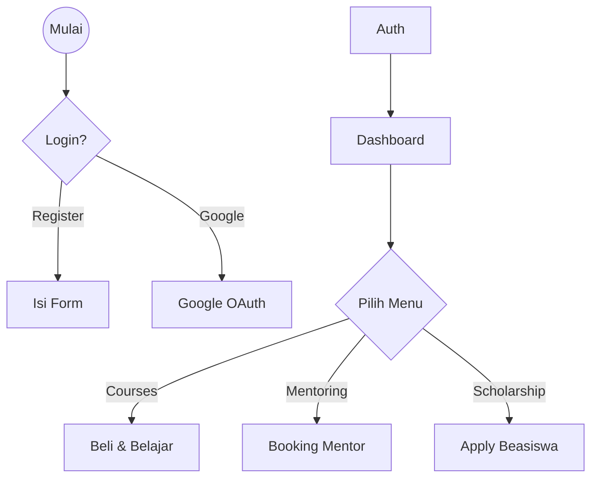
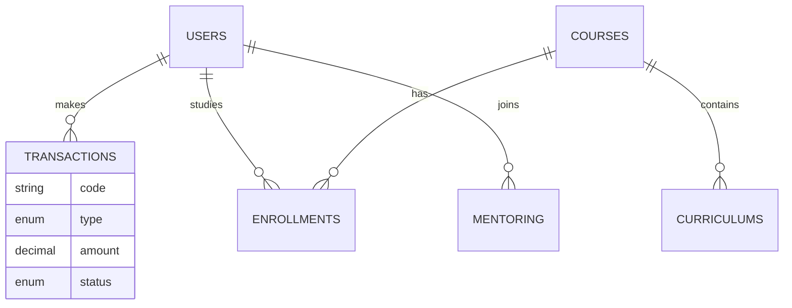

# BAB III
# PELAKSANAAN PRAKTIK KERJA LAPANGAN

## III.1 Kegiatan Bangkit Academy Machine Learning Path
<Deskripsi persoalan sesuai dengan topik project PLK.>

## III.2 Proses Implementasi Backend REST API Laravel
Proses pengembangan backend aplikasi Student App dilakukan menggunakan framework Laravel dengan arsitektur REST API. Berikut adalah tahapan implementasi yang dilakukan:

### 1. Instalasi dan Konfigurasi Lingkungan Kerja
Tahap awal dimulai dengan mempersiapkan lingkungan pengembangan:
- **Instalasi Tools**: Menginstall PHP 8.2, Composer, dan database MySQL (XAMPP/Laragon).
- **Inisialisasi Proyek**: Membuat proyek Laravel baru menggunakan perintah `composer create-project laravel/laravel`.
- **Konfigurasi Environment**: Mengatur file `.env` untuk koneksi database (`DB_DATABASE`, `DB_USERNAME`), konfigurasi mail server, dan kredensial layanan pihak ketiga seperti Google Client ID untuk fitur Social Login.

### 2. Perancangan Basis Data dan Migrations
Database dirancang menggunakan fitur Migration Laravel untuk memastikan konsistensi skema antar lingkungan (local/production):
- **Tabel Utama**: Membuat tabel `users` untuk menyimpan data pengguna dengan role yang berbeda (student, mentor, corporate), tabel `courses` untuk materi pembelajaran, dan `subscriptions` untuk manajemen langganan.
- **Relasi Antar Tabel**: Menentukan foreign key constraints, misalnya `user_id` pada tabel `transactions` yang berelasi dengan tabel `users`.
- **Seeders**: Membuat seeder untuk data awal seperti admin user, kategori course, dan opsi pembayaran.

### 3. Pengembangan API dan Logika Bisnis
Implementasi fitur dilakukan dengan memisahkan logic ke dalam beberapa layer untuk kemudahan maintenance (Service Repository Pattern):
- **Routing**: Mendefinisikan endpoint API pada file `routes/api.php`, dikelompokkan berdasarkan role dan fitur (misal: `/api/student`, `/api/mentor`) menggunakan Route Groups.
- **Service Layer**: Memindahkan logika bisnis kompleks dari Controller ke Service Class (di folder `app/Services`). Contohnya, `SubscriptionService` menangani logika validasi dan pembuatan langganan baru.
- **Controller**: Controller hanya bertugas menerima request, memanggil Service yang sesuai, dan mengembalikan response JSON yang standar.

### 4. Implementasi Fitur Autentikasi dan Keamanan
Keamanan aplikasi dijaga melalui implementasi autentikasi yang ketat:
- **JWT (JSON Web Token)**: Menggunakan package `tymon/jwt-auth` untuk autentikasi API berbasis token. Setiap request ke endpoint yang dilindungi harus menyertakan token valid di header Authorization.
- **Google Social Login**: Mengintegrasikan `laravel/socialite` untuk memungkinkan pengguna login menggunakan akun Google mereka.
- **Middleware**: Menerapkan middleware kustom dan bawaan (seperti `auth:api`) untuk membatasi akses berdasarkan role pengguna.

### 5. Integrasi Layanan Pihak Ketiga
Aplikasi terintegrasi dengan layanan eksternal untuk fitur pembayaran:
- **Midtrans Payment Gateway**: Mengimplementasikan Snap API untuk proses pembayaran. Webhook endpoint dibuat untuk menerima notifikasi status pembayaran secara real-time dari Midtrans dan memperbarui status transaksi di database lokal secara otomatis.

### 6. Penerapan Best Practices dan Refactoring
Kode terus dioptimalkan selama pengembangan:
- **Traits**: Menggunakan Trait `ApiResponse` (di `app/Traits`) untuk menstandarisasi format response JSON (success, error, validation errors) di seluruh controller, sehingga memudahkan konsumsi API oleh Frontend.
- **Policy**: Menggunakan Laravel Policies untuk otorisasi tingkat resource, memastikan user hanya bisa mengubah data milik mereka sendiri.

### 7. Pengujian dan Dokumentasi
- **Postman**: Setiap endpoint diuji menggunakan Postman Collection yang disusun rapi per modul.
- **Swagger UI**: Dokumentasi API dibuat otomatis menggunakan `l5-swagger` (Swagger/OpenAPI), memudahkan tim frontend dan developer lain memahami struktur request dan response API.

## III.3 Pencapaian Bangkit Academy Machine Learning Path
<Beri judul sub bab sesuai dengan pencapaian hasil dari Project PLK.>

## III.4 Alur Kerja Aplikasi (User Flow)
Berikut adalah alur kerja lengkap untuk setiap role dalam aplikasi Student App.

### 1. Flow Student (Mahasiswa)
Mahasiswa adalah pengguna utama yang mengakses materi pembelajaran, mentoring, dan beasiswa.
- **Registrasi & Login**: Mendaftar akun atau login via Google.
- **E-Learning**: Melihat daftar kursus, membeli (transaksi), mengakses materi (Curriculum), dan klaim sertifikat.
- **Mentoring**: Mencari mentor, booking jadwal, melakukan pembayaran, dan melaksanakan sesi via video conference.
- **Scholarship**: Mendaftar beasiswa dan memantau status aplikasi.
- **Portfolio**: Mengupload CV, sertifikat, dan data pendukung karir lainnya.

### 2. Flow Mentor
Mentor bertugas membimbing mahasiswa.
- **Manajemen Jadwal**: Mengatur ketersediaan waktu untuk sesi mentoring.
- **Sesi Mentoring**: Menerima booking, memberikan Need Assessment, mengupload Coaching Files, dan menyelesaikan sesi.

### 3. Flow Corporate (Perusahaan)
- **Beasiswa**: Membuat program beasiswa dan menyeleksi pelamar (Accepted/Rejected).
- **Artikel**: Mempublikasikan artikel atau berita perusahaan.

### 4. Flow Admin
- **Manajemen User**: Mengelola seluruh data pengguna.
- **Verifikasi**: Memverifikasi pembayaran manual dan konten (artikel/beasiswa).
- **CMS**: Mengelola konten global seperti kategori course dan konfigurasi sistem.

## III.5 Perancangan Database
Sistem basis data dirancang untuk mendukung kebutuhan multi-role dan transaksi yang kompleks. Berikut adalah visualisasi Entity Relationship Diagram (ERD) dari sistem:

**Tabel Utama:**
1.  **Users**: Menyimpan data pengguna (Student, Mentor, Corporate, Admin).
2.  **Courses & Curriculums**: Menyimpan data kursus beserta silabus materinya.
3.  **Transactions**: Menggunakan *Polymorphic Relations* untuk menangani berbagai jenis pembayaran (Course, Mentoring, Subscription) dalam satu tabel.
4.  **Enrollments**: Mencatat progres belajar siswa pada setiap kursus.
5.  **Mentoring Sessions**: Mengatur jadwal dan status pertemuan antara Mentor dan Student.

