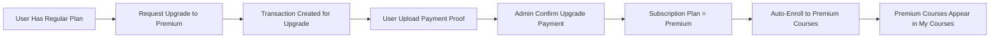

# 🔧 Fix: Auto-Enrollment Kursus Premium Setelah Langganan

## 📋 Deskripsi Masalah

Sebelumnya, ketika user berlangganan **premium subscription** dan pembayaran dikonfirmasi oleh admin, subscription statusnya berubah menjadi `active`, tetapi user **tidak otomatis mendapat akses** ke kursus premium di halaman "My Courses".

### Penyebab
- Saat admin mengkonfirmasi pembayaran subscription, hanya status subscription yang diubah
- Tidak ada enrollment otomatis yang dibuat ke kursus-kursus premium
- User harus mendaftar manual satu per satu ke setiap kursus premium

## ✅ Solusi yang Diterapkan

Sistem sekarang **otomatis mendaftarkan user** ke semua kursus yang sesuai dengan paket langganan mereka:

### 1. Auto-Enrollment saat Konfirmasi Pembayaran
**File**: `app/Services/TransactionService.php`

Ketika admin mengkonfirmasi pembayaran subscription (method `confirmPayment()`):
- ✅ **Premium Subscription** → Auto-enroll ke semua kursus `access_type = 'premium'`
- ✅ **Regular Subscription** → Auto-enroll ke semua kursus `access_type = 'regular'` dan `'free'`

```php
// Handle Subscription Activation
elseif ($transaction->transactionable_type === Subscription::class) {
    $subscription = $transaction->transactionable;
    $subscription->update(['status' => 'active']);
    
    // ✅ AUTO-ENROLL: Premium subscription
    if ($subscription->plan === 'premium') {
        $this->autoEnrollPremiumCourses($transaction->user_id);
    }
    // ✅ AUTO-ENROLL: Regular subscription
    elseif ($subscription->plan === 'regular') {
        $this->autoEnrollRegularCourses($transaction->user_id);
    }
}
```

### 2. Auto-Enrollment saat Upgrade Subscription
**File**: `app/Services/SubscriptionService.php`

Ketika user upgrade subscription dari regular ke premium (method `upgradeSubscription()`):
- ✅ Sistem akan otomatis mendaftarkan user ke semua kursus premium yang belum di-enroll

```php
// ✅ AUTO-ENROLL: Jika upgrade ke premium
if ($plan === 'premium' && $oldPlan !== 'premium') {
    $this->autoEnrollPremiumCourses($subscription->user_id);
}
```

### 3. Helper Methods
Menambahkan 2 helper methods untuk auto-enrollment:

#### TransactionService.php
- `autoEnrollPremiumCourses($userId)` - Enroll ke semua kursus premium
- `autoEnrollRegularCourses($userId)` - Enroll ke semua kursus regular/free

#### SubscriptionService.php
- `autoEnrollPremiumCourses($userId)` - Enroll ke semua kursus premium saat upgrade

### 🔍 Cara Kerja Auto-Enrollment

**FLOW LENGKAP (Subscription Premium):**

1. **User Subscribe** - `POST /api/subscriptions`
   ```php
   // Subscription dibuat dengan status = 'pending'
   Subscription::create([
       'user_id' => $user->id,
       'plan' => 'premium',
       'status' => 'pending',  // ⬅️ Status awal
       ...
   ]);
   ```

2. **Transaction Dibuat** - `POST /api/transactions/subscriptions`
   ```php
   // Transaction dibuat dengan status = 'pending'
   Transaction::create([
       'type' => 'subscription',
       'status' => 'pending',  // ⬅️ Menunggu pembayaran
       'amount' => 199000,
       ...
   ]);
   ```

3. **User Upload Bukti Pembayaran** - `POST /api/transactions/{id}/upload-proof`
   ```php
   // Upload file bukti pembayaran
   $transaction->update([
       'payment_proof' => $filePath,  // ⬅️ Bukti tersimpan
   ]);
   ```

4. **Admin Konfirmasi Pembayaran** - `POST /api/transactions/{id}/confirm`
   ```php
   // confirmPayment() dipanggil
   $transaction->update(['status' => 'paid']);  // ⬅️ Pembayaran dikonfirmasi
   $subscription->update(['status' => 'active']); // ⬅️ Subscription aktif
   
   // ✅ AUTO-ENROLLMENT TERJADI DI SINI
   if ($subscription->plan === 'premium') {
       $this->autoEnrollPremiumCourses($transaction->user_id);
   }
   ```

5. **Auto-Enrollment Logic:**
   ```php
   // Ambil semua kursus premium
   $premiumCourses = Course::where('access_type', 'premium')->get();
   
   foreach ($premiumCourses as $course) {
       // Cek apakah user sudah enrolled
       $alreadyEnrolled = Enrollment::where('user_id', $userId)
           ->where('course_id', $course->id)
           ->exists();
       
       // Jika belum enrolled, buat enrollment baru
       if (!$alreadyEnrolled) {
           Enrollment::create([
               'user_id'   => $userId,
               'course_id' => $course->id,
               'progress'  => 0,
               'completed' => false,
           ]);
       }
   }
   ```

6. **Hasil Akhir:**
   - ✅ Transaction status = `paid`
   - ✅ Subscription status = `active`
   - ✅ User ter-enroll ke semua kursus premium
   - ✅ Kursus muncul di `GET /api/my-courses`

**KEAMANAN:**
- ⚠️ Auto-enrollment **TIDAK akan terjadi** jika:
  - Transaction masih status `pending`
  - User belum upload bukti pembayaran
  - Admin belum konfirmasi pembayaran
  - Subscription masih status `pending`

## 📊 Alur Lengkap

### Scenario 1: Subscription Baru (Premium)

```mermaid
graph LR
    A[User Subscribe Premium] --> B[Transaction Created - Status Pending]
    B --> C[User Upload Payment Proof]
    C --> D[Admin Review Payment Proof]
    D --> E[Admin Confirm Payment]
    E --> F[Transaction Status = Paid]
    F --> G[Subscription Status = Active]
    G --> H[Auto-Enroll to ALL Premium Courses]
    H --> I[Courses Appear in My Courses]
```


**PENTING**: Auto-enrollment **HANYA terjadi** setelah:
1. ✅ User upload bukti pembayaran
2. ✅ Admin konfirmasi pembayaran melalui `POST /api/transactions/{id}/confirm`
3. ✅ Transaction status berubah menjadi `paid`
4. ✅ Subscription status berubah menjadi `active`

### Scenario 2: Upgrade Subscription


**CATATAN untuk Upgrade**:
- Upgrade juga harus melalui proses transaksi dan konfirmasi pembayaran
- Admin harus konfirmasi pembayaran upgrade sebelum auto-enrollment terjadi

## 🎯 Keuntungan Fitur Ini

✅ **User Experience Lebih Baik**
- User langsung bisa akses semua kursus premium setelah berlangganan
- Tidak perlu mendaftar manual satu per satu

✅ **Konsistensi Data**
- Semua user premium pasti punya akses ke semua kursus premium
- Tidak ada kursus yang terlewat

✅ **Efisiensi Admin**
- Admin tidak perlu mendaftarkan user manual ke setiap kursus
- Proses otomatis dan transparan

✅ **Scalability**
- Jika ada kursus premium baru ditambahkan, user yang sudah berlangganan bisa di-enroll otomatis
- (Note: Untuk kursus baru setelah subscription aktif, perlu implementasi tambahan)

### 📝 Testing

### Test Case 1: Premium Subscription - New User (Full Flow)
1. ✅ User buat subscription premium → `POST /api/subscriptions`
   - **Expected**: Subscription created with `status = 'pending'`
   - **Expected**: Transaction created with `status = 'pending'`
2. ✅ User upload bukti pembayaran → `POST /api/transactions/{id}/upload-proof`
   - **Expected**: Transaction memiliki `payment_proof` path
   - **Expected**: Status masih `pending`
3. ✅ Admin konfirmasi pembayaran → `POST /api/transactions/{id}/confirm`
   - **Expected**: Transaction `status = 'paid'`
   - **Expected**: Subscription `status = 'active'`
   - **Expected**: User ter-enroll ke semua kursus premium
   - **Expected**: Log "Auto-enrolled user to premium courses" muncul
4. ✅ Cek my courses → `GET /api/my-courses`
   - **Expected**: Semua kursus premium muncul dalam daftar

### Test Case 2: Subscription Pending (Tanpa Konfirmasi Admin)
1. User buat subscription premium
2. User upload bukti pembayaran
3. **Admin BELUM konfirmasi**
4. **Expected**: User TIDAK ter-enroll ke kursus premium
5. **Expected**: `GET /api/my-courses` TIDAK menampilkan kursus premium
6. **Expected**: Subscription masih `status = 'pending'`

### Test Case 3: Upgrade Regular → Premium
1. User dengan subscription regular (sudah aktif)
2. Request upgrade ke premium
3. Upload bukti pembayaran upgrade
4. Admin konfirmasi pembayaran upgrade
5. **Expected**: User ter-enroll ke semua kursus premium
6. **Expected**: Kursus premium muncul di my courses

### Test Case 4: Duplicate Prevention
1. User sudah enrolled manual ke Course A (premium)
2. Kemudian subscribe premium
3. Admin konfirmasi pembayaran
4. **Expected**: Tidak ada duplikasi enrollment
5. **Expected**: Course A tetap 1 enrollment dengan progress yang sudah ada

## 🔄 Future Improvements

1. **Auto-Enroll Kursus Baru**
   - Ketika admin menambah kursus premium baru
   - Sistem bisa auto-enroll semua user yang sudah berlangganan premium

2. **Notifikasi**
   - Kirim email/notifikasi ke user saat auto-enrollment berhasil
   - List semua kursus yang baru tersedia

3. **Webhook/Event**
   - Trigger event `SubscriptionActivated`
   - Trigger event `UserEnrolledToCourse`

## 📁 Files Modified

1. `app/Services/TransactionService.php`
   - Modified: `confirmPayment()` method
   - Added: `autoEnrollPremiumCourses()` method
   - Added: `autoEnrollRegularCourses()` method

2. `app/Services/SubscriptionService.php`
   - Modified: `upgradeSubscription()` method
   - Added: `autoEnrollPremiumCourses()` method
   - Added: Import `Enrollment` model

## 📞 API Endpoints yang Terpengaruh

- `POST /api/transactions/{id}/confirm` - Admin confirm payment (trigger auto-enroll)
- `PUT /api/subscriptions/{id}/upgrade` - Upgrade subscription (trigger auto-enroll)
- `GET /api/my-courses` - Akan menampilkan kursus premium setelah auto-enroll

## 🐛 Troubleshooting

### Issue: Kursus tidak muncul di My Courses
**Check**:
1. Apakah subscription status = `active`?
2. Apakah transaksi sudah status = `paid`?
3. Check log: Apakah ada log "Auto-enrolled user to premium courses"?
4. Check database: `SELECT * FROM enrollments WHERE user_id = X`

### Issue: Duplicate Enrollment
**Check**:
1. Lihat log error - seharusnya ada check `$alreadyEnrolled`
2. Verify database unique constraint pada `enrollments` table

---

**Date**: 2026-01-01  
**Version**: 1.0  
**Author**: GitHub Copilot  
**Status**: ✅ Implemented & Ready for Testing
