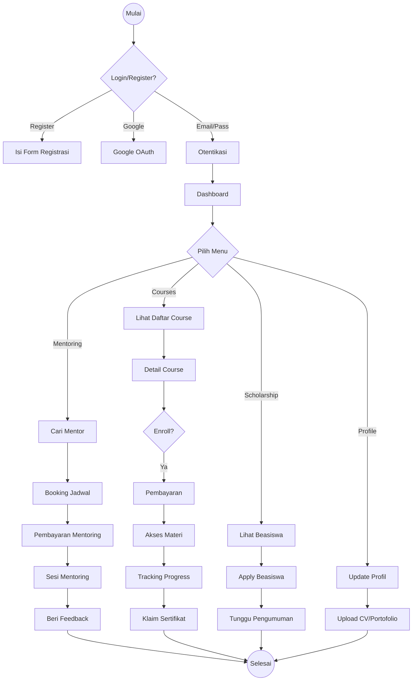
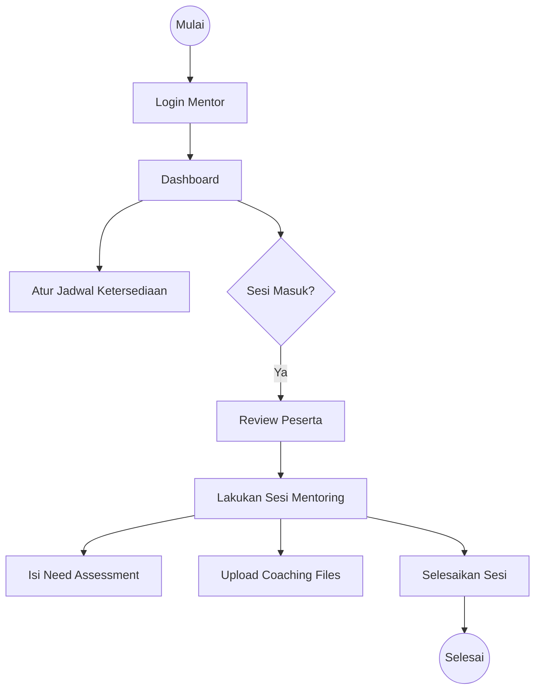
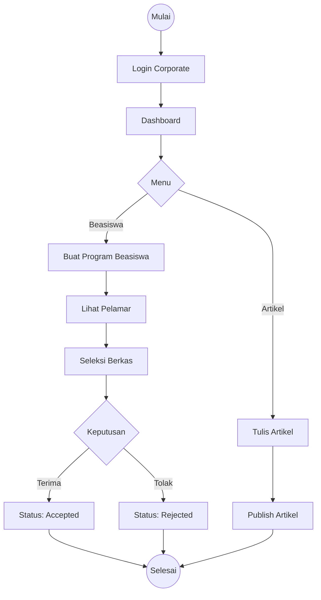
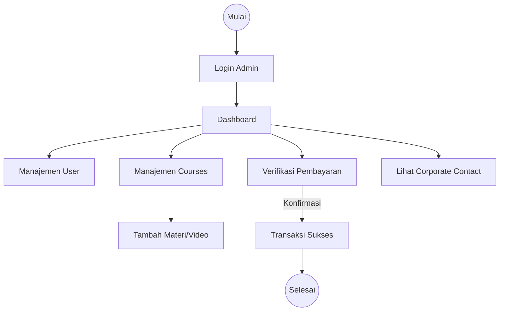

# User Flow Documentation

Berikut adalah alur kerja lengkap (User Flow) untuk setiap role dalam aplikasi Student App.

## 1. Flow Student (Mahasiswa)

Mahasiswa adalah pengguna utama yang mengakses materi pembelajaran, mentoring, dan beasiswa.

### Alur Utama
1.  **Registrasi & Login**: Mendaftar akun atau login via Google.
2.  **E-Learning**:
    *   Melihat daftar kursus.
    *   Membeli kursus (transaksi).
    *   Mengakses materi (Curriculum).
    *   Mengerjakan kuis/tugas (jika ada).
    *   Mendapatkan sertifikat (progress 100%).
3.  **Mentoring**:
    *   Mencari mentor.
    *   Booking jadwal sesi mentoring.
    *   Melakukan pembayaran mentoring.
    *   Melaksanakan sesi (Need Assessment & Coaching Files).
    *   Memberikan review/feedback.
4.  **Scholarship**:
    *   Melihat info beasiswa.
    *   Mendaftar beasiswa (Apply).
    *   Memantau status aplikasi.
5.  **Portfolio**:
    *   Mengupload CV dan sertifikat.
    *   Menambahkan pengalaman organisasi dan prestasi.

---

## 2. Flow Mentor

Mentor bertugas membimbing mahasiswa melalui sesi mentoring one-on-one.

### Alur Utama
1.  **Login**: Masuk sebagai Mentor.
2.  **Manajemen Jadwal**: Mengatur ketersediaan jadwal (Schedule).
3.  **Sesi Mentoring**:
    *   Menerima booking sesi.
    *   Membuat Need Assessment untuk mentee.
    *   Mengupload Coaching Files (materi pendukung).
    *   Menyelesaikan sesi (Mark as Completed).
4.  **Profil Mentor**: Mengupdate keahlian dan pengalaman untuk menarik mentee.

---

## 3. Flow Corporate (Perusahaan/Mitra)

Corporate berfokus pada penyediaan beasiswa dan publikasi artikel/info karir.

### Alur Utama
1.  **Login**: Masuk sebagai Corporate.
2.  **Beasiswa (Scholarship)**:
    *   Membuat program beasiswa baru.
    *   Melihat pelamar beasiswa.
    *   Menyeleksi pelamar (Update Status: Accepted/Rejected).
3.  **Artikel**:
    *   Menulis artikel atau berita perusahaan.
    *   Mempublikasikan artikel.

---

## 4. Flow Admin

Admin memiliki akses penuh untuk manajemen sistem dan moderasi.

### Alur Utama
1.  **User Management**: Mengelola user (create, update, suspend, activate).
2.  **Course Management**: Membuat dan mengedit course serta kurikulum.
3.  **Verifikasi Pembayaran**: Mengkonfirmasi transaksi pembayaran manual (jika bukan otomatis).
4.  **Content Moderation**: Mengelola artikel dan beasiswa (bisa edit/hapus konten yang tidak sesuai).
5.  **Corporate Contact**: Melihat pesan masuk dari perusahaan yang ingin bekerja sama.

